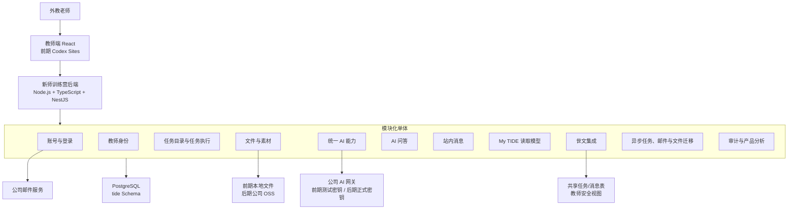

# 新师训练营教师端｜后端整体架构方案

## 0. 文档定位

| 项目 | 内容 |
| --- | --- |
| 文档状态 | 本地后端已落地，生产接入待后续 |
| 日期 | 2026-07-22 |
| 目标 | 为真实功能闭环确定后端总结构、技术方向和阶段性部署方式 |
| 事实依据 | 当前主 PRD、《教师端共享任务表契约》和当前物理 Schema |
| 非目标 | 生产数据库、账号、授权和部署 |

本文是技术设计草案，不替代主 PRD 和接口文档。涉及产品范围、正式接口或业务字段变化时，仍需同步主 PRD 与接口文档，并保持联动口径版本一致。

## 1. 已确认结论

1. 本期目标是真实功能闭环，不是只有页面和 Mock 数据。
2. 后端采用一个整体部署、内部按模块拆分的“模块化单体”，不在一期拆成多个微服务。
3. 推荐技术方向为 Node.js + TypeScript + NestJS + PostgreSQL。
4. 教师端前端与正式后端通过同域或受控 API 通信；AI 问答正式接入后不使用 iframe。
5. 前期测试环境：Codex Sites 承载前端，Mac mini 运行后端、本系统自行新建的本地 PostgreSQL 数据库和临时本地文件存储，通过 Cloudflare Quick Tunnel 访问。
6. 正式环境：迁移到公司盖娅平台；文件迁移到公司 OSS。
7. AI 从前期开始统一接入公司 AI 网关；沿用 `backend/examples/ai_gateway_video_assessment.py` 中的请求结构和 `biz_id / biz_type`，`provider` 使用公司网关实际支持豆包的 `VOLCENGINE`，模型使用 `doubao-seed-2-0-lite`，后期只替换正式密钥或环境配置。
8. AI 能力一期只有两类：必修任务图片审核、仅文字的 AI FAQ 问答。两者共用 AI 网关适配器和调用记录，不共用业务数据。
9. 公司邮件服务负责发送固定 HTML 模板；后端只动态传入 `email / reset_url / expires_in_minutes`，验证令牌、有效期和一次性使用规则由本系统负责。
10. 注册时老师填写公司邮箱和 `teacherId`；后端确认世文数据库存在该 `teacherId`。一个 `teacherId` 只绑定一个邮箱，一个邮箱只绑定一个 `teacherId`。
11. 不增加邀请码或第二身份因子；“teacherId 被他人抢先绑定”作为已知风险记录。
12. 当前没有已经开始任务的真实老师。上线前内容可以直接调整；第一位真实老师开始任务后，再冻结任务版本。
13. 世文与本系统不建设任务 HTTP 下发/回传接口；任务状态以共享 `task_assignments` 为唯一事实。
14. 两端共用一个 PostgreSQL；教师端自有表使用 `tide` Schema，应用使用 `tit_teacher_crud` 最小权限。

## 2. 为什么选择模块化单体

可以把它理解为“一套后端里有多个职责清楚的房间”：

- 对外只有一套登录、一套接口和一次部署；
- 账号、任务、文件、AI、消息和世文集成各自管理自己的代码和数据；
- 模块之间只能通过明确的方法调用，不能随意修改对方数据；
- 后续某个模块压力明显增加时，再单独拆服务。

一期不拆微服务，原因是当前团队规模、任务数量和部署条件都更适合先完成真实闭环。过早拆分会增加服务发现、网络鉴权、日志追踪和发布协调成本。

## 3. 总体结构



## 4. 技术基线

| 领域 | 推荐方案 | 说明 |
| --- | --- | --- |
| 后端语言 | TypeScript | 可直接复用现有 AI 项目中的 JavaScript 业务逻辑，减少迁移成本 |
| 后端框架 | NestJS | 适合按账号、任务、文件、AI 等模块划分；具体版本在开发前冻结 |
| 数据库 | PostgreSQL | 两端共用数据库；共享任务表 + `tide` 自有 Schema + 最小权限角色 |
| 文件存储 | 可替换存储接口 | 前期本地目录；后期公共课程素材使用 OSS + CDN，老师上传图片使用私有 OSS + 临时签名链接 |
| 邮件 | 公司邮件服务适配器 | 调用 `mg.51talk.me`；固定服务字段放后端配置，只动态传 `email / reset_url / expires_in_minutes` |
| AI | 公司 AI 网关适配器 | 参考 `backend/examples/ai_gateway_video_assessment.py` 的请求结构，Provider 使用 `VOLCENGINE`，模型为 `doubao-seed-2-0-lite`；密钥只在后端环境变量保存 |
| 异步任务 | 同仓库 Worker | 负责邮件发送、文件迁移和内部异步处理；世文共享数据库主链路不需要 HTTP 投递 Worker |
| 前端托管 | 前期 Codex Sites | 仅承载教师端页面；真实数据仍通过 Mac mini 后端访问 |
| 正式部署 | 公司盖娅平台 | 部署结构、密钥管理、域名和监控按公司平台能力补充 |

## 5. 关键业务链路

### 5.1 注册与登录

```text
老师填写公司邮箱、teacherId 和密码
  → 后端只读查询世文数据库，确认 teacherId 存在
  → 后端事务检查 teacherId 和邮箱均未被绑定
  → 创建未验证账号和绑定记录
  → 生成一次性邮箱验证令牌
  → 调用公司邮件服务发送验证邮件
  → 老师完成邮箱验证
  → 账号生效并允许登录
```

约束：

- `teacherId` 与邮箱必须双向唯一；并发注册时由数据库唯一约束兜底。
- 密码只保存安全哈希，不保存明文。
- 验证和重置令牌只保存哈希，必须有有效期且只能成功使用一次。
- 查询世文身份只使用只读账号或教师安全视图，不使用当前过宽的临时 CRUD 权限作为正式方案。

### 5.2 任务执行

```text
老师打开任务
  → 后端幂等补齐并读取共享 assignment
  → 读取 `tide` 执行版本、步骤和进度
  → 保存本地证据
  → 按任务级规则验证
  → 在同一事务按旧 `row_version` 更新共享状态
  → 数据库写审计和 Outbox
```

原则：共享状态与本地证据同事务提交；世文结分延迟不能回滚合法完成的 assignment。

### 5.3 图片审核任务

```text
老师上传图片
  → 文件模块保存文件
  → 任务模块调用统一 AI 图片审核能力
  → AI 返回 PASS / RETRY / ERROR 及教师可见说明
  → 任务模块保存审核记录并更新任务状态
```

- `PASS`：允许任务通过。
- `RETRY`：不符合要求，说明原因并允许重新上传。
- `ERROR`：模型、网络或网关异常，不得把老师判为最终失败。
- AI 返回判断，但只有任务模块可以修改任务状态。
- 嘉荷负责该任务的审核标准、提示词内容、页面和重试体验；公共 AI 调用、密钥、日志和网关切换由统一 AI 模块负责。

### 5.4 AI 问答

```text
老师打开帮助入口
  → React 问答抽屉调用本系统后端
  → 后端从登录态获得教师身份
  → 后端根据 route / taskId 补充当前阶段和任务上下文
  → 按英文关键词、同义词和自然表达宽松召回生效 FAQ
  → AI 判断候选是否符合意图
  → 没有候选或候选不相关时，仅在完整 FAQ 问题目录中做语义匹配
  → 意图明确且命中后，基于 FAQ 正文生成带来源的答案
  → 意图不明确则追问澄清；确认无相关 FAQ 才拒答并记录 Gap
```

一期规则：

- 只支持文字提问，不提供图片或附件上传。
- 只依据生效、可回答的 FAQ 正文生成答案；目录语义匹配阶段只允许选择 FAQ 或追问，不允许自由回答。
- 前端不提交或伪造 `teacherId`，教师身份由登录态确定。
- AI 问答不计算积分、不判断毕业、不修改任务状态。
- 问题正文和答案正文不提供给世文，也不写入共享 assignment。
- `backend/reference/teacher-faq-demo` 作为迁移输入；其模型、检索、提示词和拒答逻辑可复用，独立 `server.mjs`、iframe 协议和本地事件文件不进入正式架构。
- 正式问答会话、消息、来源、反馈和 FAQ Gap 进入本系统 PostgreSQL，不创建独立数据库；现有浏览器内存历史和 `qa-events.jsonl` 只作为原型。

### 5.5 世文数据交互

世文继续是以下数据的唯一权威来源：

- 未来正式发布的个性化任务触发和分配；
- 五维积分、总分、逐课归因；
- 出营、试用期、金牌和产能里程碑结果；
- 站内消息内容。

本系统是以下数据的唯一写入方：

- 账号和邮箱验证；
- 教师端任务执行过程与本地完成结果；
- 上传素材、图片审核、答案、清单和进度；
- AI 问答、反馈和 FAQ 未命中记录；
- 共享 G 任务的允许状态字段、`tide` 执行过程和审计记录。

跨系统访问方式：

- 任务：双方直接读写共享 `task_templates/task_assignments`，写入范围由角色和触发器限制；
- 消息：教师端可读外部消息，并幂等回写已读与点击；
- 教师资料、指标和课程：仍通过安全视图只读；
- 世文只读合法 `COMPLETED` 并向 `score_entries` 幂等结分。

安全视图读取失败时返回暂时不可用，不使用旧业务投影或 Mock 代替真实结果。

## 6. 前期与正式部署

### 6.1 前期内部真实闭环

```text
Codex Sites 前端
  → Cloudflare Quick Tunnel 随机地址
  → Mac mini 后端
  → Mac mini 上为本系统自行新建的 PostgreSQL 数据库
  → Mac mini 本地文件目录
```

适用范围：项目组内部、测试账号和测试素材。

已确认 Mac mini 配置足够，网络可以正常建立 Quick Tunnel。Quick Tunnel 地址可能变化且无稳定性保证，不作为正式教师长期入口。

Codex Sites 与 Quick Tunnel 属于不同来源。内部测试阶段只允许明确的 Codex Sites 来源访问 API，不允许使用 `*` 放开跨域；登录态使用短期访问令牌并控制有效期。真实外教试点前应改为稳定域名和正式会话方案，避免长期依赖临时跨域链路。

### 6.2 少量真实外教试点门槛

是否开展真实外教试点仍待确认。开放前至少满足：

1. 公司 OSS 已可用，真实上传素材不再只依赖 Mac mini 本地磁盘；
2. 有稳定访问地址，不使用随重启变化的 Quick Tunnel 地址；
3. PostgreSQL、文件和密钥具备备份与恢复方案；
4. 登录、越权、文件访问和速率限制通过基础安全检查；
5. 测试与正式数据明确隔离；
6. 已确认真实教师数据的访问权限和保留期限。

### 6.3 正式环境

```text
公司域名
  → 盖娅平台上的前端与后端
  → 公司 PostgreSQL（共享任务表 / tide 自有 Schema / 受限角色）
  → 公司 OSS
  → 公司 AI 网关
  → 公司邮件服务
```

迁移时保持教师端 HTTP 接口和共享表契约不变；AI 继续使用同一公司网关，只替换正式密钥或环境配置。

## 7. 安全与可靠性底线

- 所有数据库、AI、邮件和 OSS 密钥只保存在后端环境配置或公司密钥管理系统。
- 浏览器不直连数据库、OSS 管理接口、AI 模型或世文数据库。
- 文件下载必须通过当前登录老师和文件归属校验，不公开真实存储路径。
- 日志不得记录明文密码、令牌、数据库连接串、完整图片、学生信息或内部证据。
- 对邮件、登录、AI 问答和上传接口实施限流。
- 关键状态变更与本地证据使用同一数据库事务；共享触发器递增 `row_version` 并写审计/Outbox。
- AI 结果必须保存模型/网关、提示词版本、规则版本和调用时间，便于复查。
- 产品分析事件不自动回传世文，不把原始答案、图片或文件地址写入分析事件。

## 8. 内容与版本规则

- 一期不建设运营后台。
- 任务、题目、素材说明和 FAQ 通过版本化配置文件或受控导入脚本维护。
- 当前尚无真实老师开始任务，上线前允许直接调整内容。
- 第一位真实老师开始任务后：任务实例必须绑定当时的 `task_template_version` 和 `execution_contract_version`。
- 已开始的任务继续使用原版本；新老师使用新的生效版本。
- 本规则只预留必要数据字段，一期不建设复杂的版本迁移平台。

## 9. 进入开发前的门槛

1. 三份技术方案完成评审。
2. 主 PRD 与接口文档已补充 AI 问答、AI 图片审核、注册绑定和阶段部署口径，并同步联动版本。
3. 完成本系统 PostgreSQL Schema / DDL 初稿；任务专属字段可在对应任务开发前补充。
4. 确认后端工程目录、环境分层和密钥管理方式。
5. 确认 Mac mini 本地文件目录、Mock 数据标记和本地备份方式。

图片审核任务级 PRD、正式 OSS 参数、世文正式安全视图和数据库只读角色不阻塞公共后端基础开发，但必须在对应能力联调或真实教师使用前完成。

## 10. 仍待确认但不阻塞本版方案

- 盖娅平台的具体部署规格、域名、日志和密钥管理能力；
- 公司 OSS 的 Bucket、区域、访问参数和生命周期规则；公共/私有资源分类已确认；
- 公司 AI 网关真实密钥及图片输入的最终结构化输出；网关请求参考和模型已确认；
- 公司邮件服务的真实成功/失败响应、错误码和限流；请求地址、固定字段及动态变量已确认；
- 少量真实外教试点是否开展及时间；
- 教师资料、指标和课程安全视图正式字段，外部消息真实样例，以及共享数据库生产角色/授权；
- 各任务级 PRD、正式素材和完成规则。
