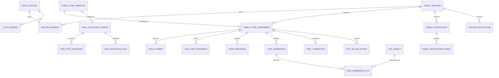

# 新师训练营教师端｜数据清单与关系设计

## 0. 文档定位

| 项目 | 内容 |
|---|---|
| 状态 | 已对齐 2026-07-22 共享数据库实现 |
| 范围 | 逻辑数据模型与归属，不重复物理字段 |
| 物理真相源 | [`backend/database`](../../backend/database/README.md) 版本化迁移 |

共享任务与写入边界以《教师端共享任务表契约》为准；世文物理表以《数据库表结构》为准。

## 1. 数据设计原则

1. 两端使用同一 PostgreSQL。教师端自有表全部放在 `tide` Schema。
2. `public.task_templates/task_assignments` 是共享任务事实；不建教师端任务副本。
3. 视频心跳、答案、清单、提交、图片和文件等过程数据只保存在 `tide`。
4. 教师端不计算或写入积分；世文只读合法 `COMPLETED` 并幂等结分。
5. 共享状态写入使用 `row_version` 乐观锁，由数据库触发器写审计与 Outbox。
6. 任务过程证据与共享状态更新必须在同一 PostgreSQL 事务中提交。
7. 安全视图不可用时不使用旧业务投影或 Mock 冒充当前权威结果。
8. 文件内容不存入 PostgreSQL；数据库只保存元数据和受控对象键。
9. Mock 必须显式标记，不得进入积分或教师真实结论。

## 2. 数据关系总览

`PUBLIC_*` 表不属于教师端迁移；其余业务表在 `tide` Schema。

## 3. 共享任务数据

| 表 | 权威内容 | 教师端权限 |
|---|---|---|
| `public.task_templates` | 任务编码、版本、教师可见静态内容、分值、阶段、优先级和四个摘要区域 | 只读已发布 G01–G09 和个性化模板；隐藏 G00 不生成入口 |
| `public.task_assignments` | 教师任务实例、Why、当前状态、截止时间、来源和 `row_version` | 读取关联已发布模板的 G01–G09；只更新契约允许的状态字段 |
| `public.audit_events/outbox_events` | assignment 创建和状态变更记录 | 由数据库触发器写入 |
| `public.score_entries` | 世文内部积分流水 | 教师端不直接读取；总览与逐课读取当前视图 |

当前按老师 `camp_day` 展示已开放的 G01–G09 共 9 个任务，并继续显示历史阶段任务；G04 是“首课备课与设备网络检测”，隐藏 G00 不生成入口。个性化任务只展示任务触发中心使用真实业务数据创建的 assignment。教师端不创建共享任务，也不使用前端 `mockAssigned` 代替真实分配。任务详情 Why 读取 `task_assignments.why` 并附加 `evidence_snapshot` 的教师安全投影；How、完成标准、完成收益分别读取模板 `payload.how_summary / completion_standard / benefit`，不得以本地执行配置覆盖。

共享目录重排时，`task_execution_versions.task_code` 按稳定 `shared_template_row_id` 迁移；执行版本 ID、assignment ID、步骤／规则 key、媒体版本和对象存储路径保持不变。展示编码与这些技术身份必须分开，避免既有进度、视频续播和审计记录失联。

## 4. `tide` 任务执行数据

| 类别 | 主要表 | 说明 |
|---|---|---|
| 执行配置 | `task_execution_versions` / `task_step_definitions` / `task_validation_rules` / `task_template_files` | 只保存步骤、观看限制、清单／上传要求和验证规则，不复制共享静态内容 |
| 尝试与提交 | `task_attempts` / `task_submissions` / `task_submission_files` | 每次尝试单独保存，不覆盖旧记录 |
| 步骤与视频 | `task_step_progress` / `video_progress` | 纯进度保存不更新共享 `row_version` |
| 专项结果 | `checklist_*` / `device_check_*` | 保存清单和设备检查结果，不写入共享 assignment |
| 完成证据 | `task_completions` | 记录完成来源、结果版本和可信时间 |
| 命令幂等 | `task_command_receipts` | 保存 `VIEW/START/PROGRESS/SUBMIT/RETRY` 的幂等结果 |

上述任务主表均使用 `task_assignment_id` 关联共享 assignment。
阔知课程与考试进度保存在 `kuozhi_course_syncs`；考试只以阔知 `percent=100` 判定，TIDE 不保存题库或作答。

## 5. 账号与身份

| 逻辑数据 | 主要表 | 关键约束 |
|---|---|---|
| 账号和绑定 | `user_accounts` / `teacher_bindings` / `binding_audit_events` | 一个邮箱只绑一个 `teacher_id`，一个 `teacher_id` 也只绑一个邮箱 |
| 令牌和会话 | `auth_tokens` / `auth_sessions` | 只保存令牌哈希；邮箱验证和重置令牌一次性使用 |
| 安全事件 | `auth_security_events` | 不保存密码、完整令牌或连接串 |
| 邮件投递 | `email_deliveries` | 保存模板、结果和脱敏错误码 |

注册时使用教师身份安全视图确认 `teacher_id` 存在；前端不得在登录后自行切换教师身份。

## 6. G01 与 My TIDE

- G01 从最新 `public.teacher_metric_snapshots` 读取 `is_self_introduce/is_cpl_tesol`，结合阔知课程 407 的考试完成结果、Essay 完成确认和完成证明；五项全部满足后才能可信完成。
- 教师资料、五维/总分和逐课事实仍通过世文权威表或安全视图读取；逐课页面不读取单课积分。
- `source_read_status` 只可记录技术可用性，不保存或冒充业务结果。
- 不保留 `teacher_identity/metric/course/g01_review` 长期业务投影。

## 7. 消息与行为事件

| 数据 | 位置 | 写入边界 |
|---|---|---|
| 外部业务消息 | `public.notifications/notification_events` | 当前老师范围内读取；幂等写首次已读、点击和对应事件 |
| TIDE 系统通知 | `tide.system_notifications` | 通知创建、撤销、已读和点击只更新自有表 |
| 产品行为事件 | `tide.app_events` | 按 `teacher_binding_id + event_id` 幂等；可选关联 `task_assignment_id` |

列表曝光、角标展示或滚动可见不写消息已读，也不改任务状态。

## 8. 文件、AI 与 FAQ

| 领域 | 主要表 | 安全要求 |
|---|---|---|
| 文件 | `file_objects` / `file_upload_intents` / `file_access_events` / `file_migrations` | 私有存储、SHA-256/MIME/大小校验、按当前老师鉴权 |
| AI 调用 | `ai_prompt_versions` / `ai_runs` | 不记密钥、原图、完整提示词或模型原文 |
| 图片审核 | `image_reviews` / `image_review_items` | `ERROR` 是技术失败，不判老师失败 |
| FAQ | `qa_conversations` / `qa_messages` / `knowledge_*` / `qa_feedback` / `faq_gaps` | 只使用已审核知识；未命中不自由猜测；不修改任务或积分 |

## 9. 权限与保留

- 本地教师应用角色是 `tit_teacher_crud`；它可读共享模板，限定创建/更新 assignment，可回写外部消息已读/点击，不能写积分。
- 生产角色、密码和授权由 DBA 管理；生产库尚未申请。
- 任务提交、完成证据、审计和账号安全日志的正式保留期在真实教师使用前确认。
- 高频过程数据按完成判定和排障需要限期保留，不无限增长。
- 文件迁移 OSS 时保留 `file_id`，并在切换对象键前验证数量、大小和哈希。
