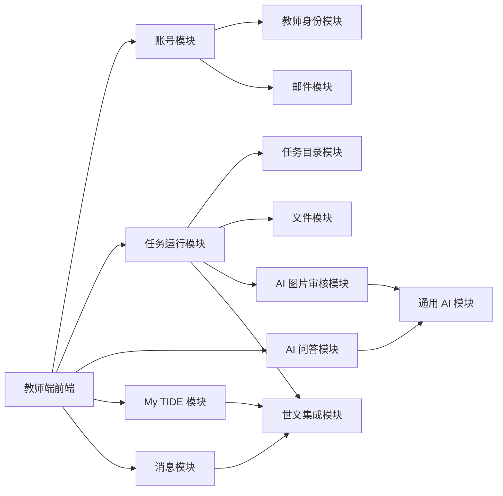

# 新师训练营教师端｜模块边界与数据归属

## 0. 文档定位

| 项目 | 内容 |
| --- | --- |
| 文档状态 | 模块与责任方案，未进入开发 |
| 日期 | 2026-07-21 |
| 目标 | 说明各模块负责什么、可以读写什么、不能越过哪些边界 |
| 非目标 | 不分配具体开发排期，不替代任务级 PRD，不修改世文原始契约 |

## 1. 总原则

1. 后端对外是一套系统，对内按业务职责分模块。
2. 每类关键数据只有一个模块可以直接写入，其他模块通过公开方法读取或请求变更。
3. 世文拥有的数据，本系统只读教师安全视图；本系统任务事件通过版本化只读视图供世文消费，双方不改对方业务源表。
4. AI 可以返回判断，但不能绕过任务模块直接修改任务状态。
5. 前端不能直接连接数据库、OSS、AI 模型、公司邮件或世文数据库。
6. 一期不建设运营后台；内容由版本化配置或受控导入维护。
7. 当前方案优先完成真实闭环，不提前建设通用工作流平台或微服务体系。

## 2. 后端模块清单

### 2.1 账号与认证模块

**负责：**

- 公司邮箱注册、邮箱验证、登录、退出和密码重置；
- 密码哈希、会话、登录限流和安全日志；
- 调用邮件模块发送验证和重置邮件。

**唯一写入：**

- 账号、密码哈希、账号状态、会话、验证/重置令牌。

**可以读取：**

- 教师身份模块返回的绑定校验结果。

**禁止：**

- 不直接读取 My TIDE 积分；
- 不直接修改任务和世文数据；
- 不把原始令牌交给邮件服务长期保存。

### 2.2 教师身份模块

**负责：**

- 注册时只读确认世文数据库中 `teacher_id` 存在；
- 建立本系统账号与世文 `teacher_id` 的稳定绑定；
- 向其他模块提供当前登录教师的内部标识和外部关联键。

**唯一写入：**

- 邮箱/账号与 `teacher_id` 的绑定关系、绑定审计和纠错记录。

**关键规则：**

- 一个 `teacher_id` 只绑定一个邮箱；
- 一个邮箱只绑定一个 `teacher_id`；
- 不使用邀请码或第二身份因子；抢先绑定风险已知并保留。

**禁止：**

- 不允许前端在登录后自行声明其他 `teacher_id`；
- 不把当前过宽的世文临时 CRUD 账号作为正式身份查询账号。

### 2.3 任务目录模块

**负责：**

- 共享 `G01–G09` 固定成长记录与教师端可见任务定义；G04 为首课准备，只保留拍照 AI 检查和课件准备确认，隐藏 G00 只读保留；
- 当前 13 类个性化改善模板的版本、执行配置和教师安全内容；
- 共享任务模板版本与本地执行版本、步骤、完成规则和素材引用；
- 根据任务级 PRD加载具体执行能力。

**唯一写入：**

- 由模板 Owner 发布共享模板；教师端只维护 `tide` 执行版本、步骤和校验配置。

**禁止：**

- 不超出已确认的现有目录自行发明新的个性化任务；
- 不在任务模板里写世文内部 SQL、阈值、证据或处罚表达；
- 不自行配置积分结果。

### 2.4 任务运行模块

**负责：**

- 读取关联已发布模板的 G01–G09，按 `camp_day` 开放 9 个可见任务；
- 读取任务触发中心已为当前老师创建的个性化 assignment，并按同一状态机执行；
- 按共享状态机维护查看、开始、进行中、提交、验证、完成和重试；
- 组织阔知课程、文档、清单、上传、设备检查等任务能力；所有考试均由阔知执行；
- 按任务级规则形成可信完成结果；
- 在同一 PostgreSQL 事务中保存本地证据并更新共享 assignment。

**唯一写入：**

- 共享 assignment 的允许字段，以及 `tide` 尝试、提交、进度、验证和完成证据。

**可以调用：**

- 文件模块保存上传内容；
- AI 图片审核模块获取审核判断；
- 共享数据库模块读写受限 assignment。

**禁止：**

- 不根据 AI、前端参数或世文返回值直接覆盖历史完成记录；
- 不在共享 assignment 中写原始答案、清单、图片、文件或视频心跳；
- 不计算五维、总分、出营和金牌结果。

### 2.5 文件与素材模块

**负责：**

- 文件上传、类型/大小校验、文件元数据、访问鉴权和下载；
- 前期本地文件存储、后期公司 OSS 的统一接口；
- 公共课程素材使用 OSS + CDN，老师上传图片使用私有 OSS + 临时签名链接；
- 文件与任务、提交、AI 审核和内容版本的关联；
- 本地到 OSS 的迁移和完整性校验。

**唯一写入：**

- 文件元数据、对象键、业务关联、迁移状态和必要访问审计。

**禁止：**

- 不把图片或文件二进制塞进普通业务表；
- 不向前端暴露本地绝对路径、OSS 管理凭据或永久公开 URL；
- 不向世文回传原始素材。

### 2.6 通用 AI 能力模块

**负责：**

- 统一封装 BytePlus ModelArk Responses API 调用、测试/正式密钥和环境配置；
- 使用 OpenAI SDK，Base URL 固定到 `https://ark.ap-southeast.bytepluses.com/api/v3`，模型使用 `seed-2-0-lite-260228`，密钥只从 `ARK_API_KEY` 注入；
- 超时、重试、限流、调用记录、模型版本和费用/用量摘要；
- 提示词版本和结构化返回校验；
- 为图片审核和 AI 问答提供底层能力。

**唯一写入：**

- 通用 AI 调用记录、Provider/模型引用、提示词版本和错误记录。

**禁止：**

- 不直接修改任务、账号、积分或消息状态；
- 不把密钥放到前端或业务配置；
- 不让业务模块依赖某个模型厂商的专属返回格式。

### 2.7 AI 图片审核模块

**负责：**

- 根据任务提供的审核标准和提示词检查上传图片；
- 返回 `PASS / RETRY / ERROR` 及教师可见说明；
- 保存图片、审核标准、提示词、模型调用和结果之间的追溯关系。

**唯一写入：**

- 图片审核记录和审核明细。

**协作边界：**

- 公共 AI 调用、密钥和 ModelArk 配置由通用 AI 模块负责；
- 嘉荷负责所开发必修任务的图片标准、提示词内容、任务页面、重试体验和验收样例；
- 任务运行模块调用审核并决定如何更新任务状态；
- 暂不提前冻结嘉荷的具体调用协议，公共 AI 能力完成后再接入和调整。

### 2.8 AI 问答模块

**负责：**

- 教师帮助入口的问答会话；
- 根据当前登录教师、页面和任务补全安全上下文；
- 检索生效 FAQ，生成有来源的受约束答案；
- 未命中拒答、FAQ 待补充、教师反馈和问答分析摘要。
- 一期只接收文字，不提供图片或附件上传；后续需要截图时复用文件模块扩展。

**唯一写入：**

- 本系统 PostgreSQL 中的问答会话、消息、来源、反馈和 FAQ Gap 记录；不单独创建问答数据库。

**禁止：**

- 不计算积分、不决定任务完成、不判断出营/金牌；
- 不把问题正文、答案正文和教师个人信息回传世文；
- 不在 FAQ 未命中时自由猜测公司制度。
- 不把现有浏览器内存历史或本地 `qa-events.jsonl` 作为正式存储。

### 2.9 My TIDE 读取模块

**负责：**

- 展示世文返回的教师安全五维、积分、逐课事实、训练营和业务结果；
- 一期按教师页面请求实时只读世文安全表或视图，不建定时全量同步；
- 将本地固定任务状态与世文结果按页面需要组合展示，但保持来源可区分。

**唯一写入：**

- 只保留技术读取状态，不保存长期业务投影，不写世文业务结果。

**禁止：**

- 不自行推算或锁定积分、出营、试用期、金牌和产能结果；
- 不用本地任务完成替代世文后续表现结果。

### 2.10 站内消息模块

**负责：**

- 直接读取共享 `notifications`，并与 `tide.system_notifications` 合并展示；
- 页面不展示来源差异，后端保留来源 ID 以正确回写；
- 老师主动打开或点击后，在对应来源表幂等保存首次时间；

**唯一写入：**

- TIDE 配置通知和任务处理结果；外部消息只回写 `status/read_at/clicked_at` 和 `notification_events`。

**禁止：**

- 不自行生成业务消息；
- 页面曝光不能自动标记已读。

公司测试库真实样例、字段和当前枚举已于 2026-07-23 核验；生产迁移窗口与最终授权仍需上线前确认。

### 2.11 世文共享数据库集成模块

**负责：**

- 直接读共享 `task_templates/task_assignments`，按阶段返回 G01–G09，并返回当前教师已触发的个性化 assignment；
- 四个教师摘要区域只读共享字段：Why=`task_assignments.why`，How／完成标准／完成收益=`task_templates.payload.how_summary / completion_standard / benefit`；本地执行步骤不得覆盖；
- 按共享 `row_version` 更新契约允许的任务状态字段；
- 从 `teacher_source_wide` 只读教师键与 `is_cpl_tesol` 作为 G01 外部证据，从共享消息表读取并回写已读/点击；
- 使用 `tit_teacher_crud` 最小权限，不写积分。

**唯一写入：**

- 固定与个性化 assignment 的允许状态字段，以及外部消息已读/点击；不创建 assignment。

**禁止：**

- 不写 `score_entries`、教师业务结果或其他越界表；
- 不把视频心跳、答案、清单、图片或文件写入共享 assignment。

**跨系统边界：**

- 两端使用同一 PostgreSQL，任务状态以共享 `task_assignments` 为唯一事实；
- 世文只读合法 `COMPLETED` 并幂等结分，不再消费教师端任务事件视图。

### 2.12 邮件模块

**负责：**

- 适配公司邮件服务；
- 使用固定 HTML 模板发送邮箱验证和密码重置邮件；
- 调用 `POST http://mg.51talk.me/api/v1/msg/send`，动态模板变量为 `email / reset_url / expires_in_minutes`；
- 保存模板 ID、发送结果、错误码和重试状态。

**唯一写入：**

- 邮件投递记录，不拥有账号验证结果。

**禁止：**

- 不生成账号安全规则；
- 不持久化可直接使用的验证或重置令牌；
- 不把公司邮件凭据放到前端。
- 不使用 Postman `Cookie / User-Agent / Connection / Accept-Encoding` 作为正式请求字段；本地 hosts 映射不写入代码。

### 2.13 审计、分析与异步任务模块

**负责：**

- 产品入口、漏斗和帮助行为等安全埋点；
- 登录、提交、验证、状态变化、事件发布等审计摘要；
- 邮件、文件迁移等异步任务与失败重试。

**禁止：**

- 分析事件不保存完整答案、清单、图片、文件地址或令牌；
- 行为埋点不用于积分、出营、处罚或任务完成判定；
- 审计记录不能替代业务主表。

## 3. 数据权威来源矩阵

| 数据或决定 | 唯一权威来源 | 本系统是否可修改 |
| --- | --- | --- |
| 本系统账号、密码、邮箱验证 | 新师训练营 | 是，仅账号模块 |
| `teacher_id` 是否存在 | 世文 | 否，只读确认 |
| 邮箱与 `teacher_id` 绑定 | 新师训练营 | 是，仅身份模块 |
| `G01–G09` 四个教师摘要区域 | 世文共享 `task_assignments/task_templates` | 否，只读展示 |
| `G01–G09` 教师端执行规则、过程与可信完成 | 新师训练营 | 是，仅任务运行模块，不覆盖世文摘要文案 |
| `G01–G09` 计分 | 世文 | 否 |
| 个性化任务触发与分配 | 世文任务触发中心与共享 `task_assignments` | 教师端不创建，只执行已分配实例和更新允许状态 |
| 五维、总分、逐课归因、产能、出营、试用期、金牌 | 世文 | 否，只读展示 |
| 教师上传图片和文件 | 新师训练营 | 是，仅文件/任务模块 |
| 图片 AI 审核结果 | 新师训练营 | 是，仅图片审核模块写审核记录 |
| 最终任务状态 | 共享 `task_assignments` | 是，仅按契约允许的状态字段 |
| AI FAQ 问答和反馈 | 新师训练营 | 是，仅问答模块 |
| 世文业务提醒内容和收件人 | 世文 | 否 |
| TIDE 系统通知内容和收件人 | 新师训练营 | 是，仅通知发布模块 |
| 消息首次打开与点击 | 各消息来源权威表 | 是，仅当前老师已读/点击 |

## 4. 模块调用方向

不允许的捷径：

- 前端 → AI 模型；
- 前端 → 世文数据库；
- AI 图片审核 → 直接修改任务状态；
- My TIDE → 直接读取世文当前积分视图；
- 文件模块 → 自行判定任务完成；
- 任务模块 → 直接写世文业务表。

## 5. 团队协作边界

本节只说明当前方案中的职责建议，不替代后续正式协作分工。

### 5.1 公共后端/架构侧

- 账号、教师身份、数据库基础、文件存储、邮件适配；
- 任务运行公共状态和跨系统可靠性；
- 通用 AI Provider、密钥、ModelArk Base URL／模型配置、调用日志；
- AI 问答正式后端整合；
- 部署、监控、备份和安全边界。

### 5.2 嘉荷负责的具体任务侧

- 已分配必修任务的页面、内容、交互和任务级 PRD；
- 图片审核任务的具体审核标准、提示词内容、教师提示和重试体验；
- 该任务的验收样例和业务正确性；
- 公共 AI 能力完成后再接入并按实际接口调整，不提前约定调用格式。

### 5.3 需要共同确认

- 图片 `PASS / RETRY / ERROR` 如何映射到该任务的正式状态；
- 模型无法判断、重复上传和服务异常的教师体验；
- 上传文件类型、大小、保留和删除规则；
- 任务级提示词、审核标准和验收用例的版本。

## 6. 内容维护边界

- 一期不建设运营后台。
- 产品/运营提供内容，开发通过版本化配置或受控导入更新。
- 上线前无真实老师时，可以直接调整初始任务和 FAQ 内容。
- 真实老师开始任务后，任务实例固定引用开始时的任务版本。
- FAQ 更新需要保留版本、生效状态、权威级别和负责人；未审核内容不能自动进入回答范围。
- 任务内容、FAQ 与提示词是三类不同版本，不能只修改其中一个却无法追溯。

## 7. 阶段性部署责任

### 7.1 前期内部闭环

| 能力 | 承载位置 |
| --- | --- |
| 教师端页面 | Codex Sites |
| 后端 API、异步任务 | Mac mini |
| PostgreSQL | Mac mini 上为本系统自行新建的独立 PostgreSQL 数据库 |
| 临时上传文件 | Mac mini 专用数据目录 |
| 公网访问 | 无账号 Cloudflare Quick Tunnel |
| AI | BytePlus ModelArk 测试环境／测试密钥 |
| 邮件 | 公司邮件服务 |

只用于项目组内部、测试账号和测试文件。Quick Tunnel 地址变化需要重新配置前端测试环境。

Codex Sites 与 Quick Tunnel 之间只开放精确来源白名单，不能使用 `*` 放开跨域。内部测试使用短期访问令牌；真实外教试点前切换稳定域名和正式会话方案。

### 7.2 少量真实外教试点

当前是否开展仍待确认。至少需要：公司 OSS、稳定访问地址、备份恢复、基础安全检查和测试/正式数据隔离。

### 7.3 正式环境

| 能力 | 承载位置 |
| --- | --- |
| 前后端 | 公司盖娅平台 |
| 数据库 | 同一公司 PostgreSQL；共享任务表 + `tide` 教师端自有 Schema + 受限角色 |
| 文件 | 公共课程素材使用 OSS + CDN；教师上传图片使用私有 OSS + 临时签名链接 |
| AI | BytePlus ModelArk 正式环境／正式密钥 |
| 邮件 | 公司邮件服务 |
| 世文集成 | 共享任务/消息表 + 教师资料、指标和课程安全视图 |

## 8. 进入开发前的待办分级

### P0：开发前必须确认

- 后端工程结构和环境分层；
- PostgreSQL 本系统 Schema 初稿及数据库角色；
- Mac mini 本地文件目录、Mock 标记和备份方式；
- 后端密钥和环境变量管理方式。

主 PRD/接口同步、注册绑定规则、ModelArk Responses API 调用、邮件请求和 OSS 公私分类已确认。嘉荷所开发图片审核任务的任务级 PRD 不阻塞公共后端基础建设，在该任务接入前补充。

### P1：联调前必须确认

- 教师资料、指标和课程安全视图的正式字段与只读角色；
- 共享任务的生产角色、授权、连接池、计分幂等和对账；
- 公司 OSS 接入参数；
- BytePlus ModelArk 真实密钥、Responses API 图片输入方式和测试连通性；
- AI 模型和图片审核结构化输出；
- 邮件真实成功/失败响应、失败重试与限流；
- Quick Tunnel 测试地址变更后的配置方式；
- Codex Sites 与测试 API 的跨域白名单和短期登录态；
- 数据备份和恢复演练。

### P2：真实外教试点前必须确认

- 稳定测试域名或公司测试入口；
- 真实教师数据访问授权；
- 文件、AI 问答正文和日志保留期限；
- 安全测试、监控告警和故障联系人；
- 从本地文件到 OSS 的迁移完成情况。

## 9. 已确认风险

| 风险 | 当前决定 | 控制方式 |
| --- | --- | --- |
| 他人知道 teacherId 后抢先绑定 | 不增加邀请码或第二校验 | 双向唯一、邮箱验证、审计及后续纠错能力；风险接受人需保留记录 |
| Quick Tunnel 地址变化或中断 | 前期继续使用 | 仅内部测试；真实外教试点前换稳定地址 |
| Mac mini 本地文件丢失 | OSS 审批前暂存本地 | 专用目录、备份、文件哈希和后续迁移记录 |
| BytePlus ModelArk 测试密钥泄露 | 前期即使用 ModelArk | `ARK_API_KEY` 只放后端环境配置；正式阶段只替换密钥，不修改业务调用 |
| AI 误判图片 | AI 可决定任务通过 | 保存规则/模型/提示词版本；`RETRY` 可重传；`ERROR` 不判老师失败 |
| 任务内容上线前持续变化 | 当前无真实老师 | 上线前直接调整；首位老师开始后冻结版本 |

## 10. 本版不做的事情

- 不建设运营后台；
- 不拆微服务；
- 不实现通用任务编排引擎；
- 不让 AI 判断积分、出营、处罚或金牌；
- 不让浏览器直连 AI、数据库、OSS 或世文；
- 不把世文临时 CRUD 权限当作正式授权；
- 不提前冻结嘉荷图片审核任务的具体调用协议；
- 不在本阶段创建代码、数据库、隧道或正式部署。
