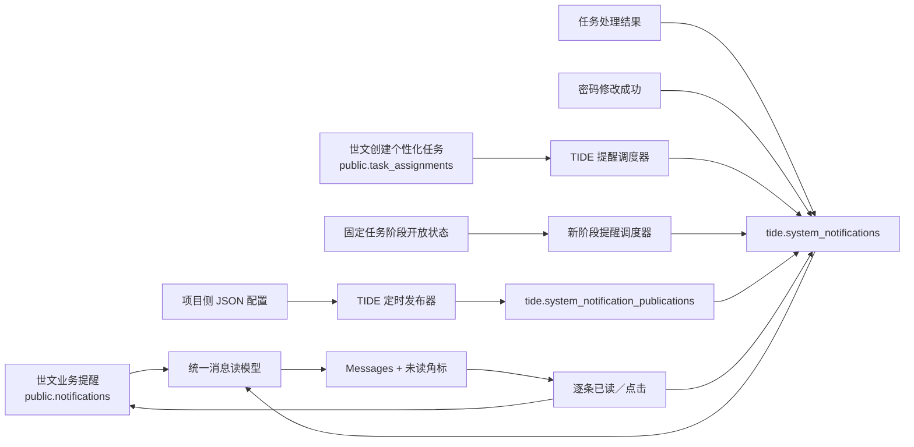

# 系统通知改造方案

日期：2026-07-30
状态：双来源消息已完成；自动提醒调度器默认关闭，待正式发布配置后启用

## 1. 当前库核验

公司测试库已有两套消息事实：

| 来源 | 权威表 | 2026-07-24 现状 |
|---|---|---|
| 世文业务提醒 | `public.notifications / notification_events` | 527 条；只负责世文业务文字提醒，当前均使用 `source_ref` 且未携带 `task_id` |
| TIDE 系统通知 | `tide.system_notifications` | 内部测试账号通知已全部撤销，测试账号初始化脚本不再创建教师可见通知；当前保留真实任务结果通知 |
| 个性化任务 | `public.task_assignments` | 831 条 `PERSONALIZED_IMPROVEMENT + TRIGGER_CENTER`；任务分配、状态、实际截止时间和时区证据以 assignment 为准 |

世文消息正文当前包含 `title / body / evidence / source_mode / trigger_rule_version`。教师端只读取老师自己的内容，并回写首次已读、点击和幂等事件，不改变收件人或正文。

## 2. 目标结构

- 页面不区分来源，按发布时间倒序统一展示。
- 底层不混表、不复制；来源 ID 只用于正确回写。
- 一期只通过 Messages 和未读角标触达，不使用 Banner 或弹窗。
- `public.notifications` 不承担个性化任务分配或到期提醒，也不保证 `task_id`；TIDE 提醒不得写入该表。

## 3. 系统通知发布

一期使用 `backend/config/system-notifications.json`，不建设管理后台。

- 只允许英文纯文本。
- `publishAt / expiresAt` 必须使用 `+08:00`。
- 受众支持全部老师，或按老师 ID、导入批次、训练营天数、账号状态、任务编码与状态组合；不允许任意 SQL。
- 发布时间到达后，在一个事务中计算收件人并写入个人通知。此后新命中的老师不补发。
- 同一 `configKey` 发布前可以修正；发布后内容、受众、计划时间、操作和收件人数不可修改。
- 更正已发布通知时，撤销旧配置并使用新 `configKey` 重发。
- 失败指数退避，最多 10 次；相同配置与老师通过 `dedupe_key` 防重。
- 固定任务业务编码重排前，必须按受众和操作的真实任务语义人工复核并重新生成所有尚未发布的配置。迁移 `0025_fixed_task_semantic_alignment` 会拒绝仍在 `SCHEDULED` 状态且 `audience.task.taskCodes` 或 `TASK_DETAIL action_target` 包含 G00／G10 的记录；G02–G09 在新旧目录中编码重叠，数据库无法只凭 code 判断原意，因此不能机械替换。

任务处理结果通知覆盖 `PASSED / FAILED / UNDER_REVIEW`，使用鼓励式英文模板和任务标题白名单变量；不安全的任务标题退化为任务编码。密码修改成功后为该账号当前有效教师绑定生成一条账号安全通知；无效或过期的重置请求不生成通知。

### 3.1 个性化任务提醒调度器

- 默认关闭；只有 `PERSONALIZED_TASK_NOTIFICATION_SCHEDULER_ENABLED=true` 时启用。
- 首次启用必须同时提供带时区的 `PERSONALIZED_TASK_NOTIFICATION_ROLLOUT_AT`。缺失或无效时后端配置校验失败，避免为现有 831 条 assignment 批量补发历史“新任务提醒”。
- 默认每 300000 毫秒扫描一次，可通过 `PERSONALIZED_TASK_NOTIFICATION_POLL_INTERVAL_MS` 调整；同一进程中的扫描不重叠。
- 只读 `public.task_assignments` 中 `task_kind = PERSONALIZED_IMPROVEMENT` 且 `creator_system = TRIGGER_CENTER` 的必要字段，不修改 assignment，不读取 `why / evidence_snapshot`。
- 新任务提醒要求 `assigned_at >= rollout_at`，幂等键为 `personalized-task-assigned:{assignment_id}`。
- 到期提醒要求 `due_at > now`、`due_at <= now + 24h`，且状态为 `ASSIGNED / VIEWED / IN_PROGRESS / FAILED`；其他状态和已过期任务不提醒，幂等键为 `personalized-task-due-24h:{assignment_id}`。
- 两类通知写入 `tide.system_notifications`，通过 `ON CONFLICT (dedupe_key) DO NOTHING` 防止并发和重启重复。`teacher_id`、`expires_at` 分别来自 assignment 的 `teacher_id`、`due_at`，操作固定为 `TASK_DETAIL -> /task/{assignment_id}`。
- 标题优先使用通过安全检查的 `display_title`，否则使用 `task_code`；正文采用固定鼓励式英文模板，不展示 Why、内部 evidence、风险标签或错误码。
- 调度器不写 `public.notifications`、`public.task_assignments` 或积分表。

### 3.2 新阶段提醒调度器

- 默认关闭；只有 `GROWTH_STAGE_NOTIFICATION_SCHEDULER_ENABLED=true` 时启用，默认每 5 分钟扫描一次。
- 只读取当前有效教师绑定、老师 `camp_day` 和固定任务完成状态，不修改 `public.teachers` 或 `public.task_assignments`。
- 阶段开放沿用任务模块口径：达到 Day 8／Day 15，或上一阶段固定任务全部为 `COMPLETED`，任一条件满足即可开放。
- 首次观察老师时，仅把当前最高开放阶段写入 `tide.growth_stage_notification_states` 作为基线，不补发历史提醒。
- 后续最高开放阶段提升时生成一条 `GROWTH_STAGE_AVAILABLE` 通知；即使一次跨越多个阶段也只提示当前最高阶段，避免连续刷屏。
- 通知使用不依赖待确认阶段名称的通用英文文案，持久化操作仍为 `TASKS -> /path`，阶段编号保存在通知 `payload.stageNumber`；消息读模型对合法的 `1–3` 组合返回 `/path?stage={stageNumber}`，前端直接定位对应已开放阶段，非法或未开放参数回退到当前最高开放阶段。
- 幂等键为 `growth-stage-available:{teacher_id}:{stage_number}`；上述精准定位不修改数据库约束，也不改变跨系统任务契约。

### 3.3 教师端成长提示

- Toki 成长建议、My TIDE 阶段标题和 Tasks 默认阶段共用实际最高开放阶段：达到阶段天数或完成上一阶段全部固定任务，任一条件满足均立即切换。
- 行动提示分别处理可重试、最终结果、提交中、同步中、审核中和内容待开放；正在提交或内容未开放时不显示重复操作按钮。
- 被推荐任务的真实 `dueAt` 在未来 24 小时内时显示稳定英文日期；已提交、审核中或已过期时不催促。
- 后端任务指引进入卡片前执行长度与教师安全检查，拒绝内部 evidence、风险标签、投诉结论和错误码；不适合展示时使用固定安全文案。
- 数据暂不可用和当前无任务均使用教师视角文案，不暴露前端、字段补齐等实现细节，也不把“当前已完成”误写成“今天完成”。

## 4. 数据库设计

### 4.1 `tide.system_notification_publications`

一条记录代表一次配置发布。

| 字段组 | 作用 |
|---|---|
| `publication_id / config_key / config_hash` | 发布主键、配置幂等和不可变校验 |
| `type_code / title / body` | 英文纯文本内容 |
| `audience` | 受控 JSON 受众条件 |
| `action_type / action_target` | 最多一个固定系统内操作 |
| `scheduled_at / expires_at` | 计划发布和失效时间 |
| `status / published_at / cancelled_at` | `SCHEDULED / PUBLISHED / CANCELLED / FAILED` 生命周期 |
| `recipient_count` | 发布时冻结的收件人数 |
| `attempt_count / next_attempt_at / last_error` | 重试状态 |

### 4.2 `tide.system_notifications`

一条记录代表一名老师收到的一条 TIDE 通知。新增：

- `publication_id`：关联配置发布；自动任务结果可为空。
- `issued_at`：统一列表排序时间。
- 固定 `action_type`：`TASK_DETAIL / MY_TIDE / TASKS / HELP / ACCOUNT`。

应用账号只能新增通知，以及更新 `read_at / clicked_at / cancelled_at / updated_at`；不能改正文或删除。数据库 Owner 保留合规清理和隔离测试维护能力。

个性化提醒不关联配置发布记录；通过唯一 `dedupe_key` 直接幂等新增。`action_type` 固定为 `TASK_DETAIL`，`action_target` 使用 assignment ID，不使用世文消息的 `task_id`。

### 4.3 `tide.growth_stage_notification_states`

每名已绑定老师仅保存一个最高已观察开放阶段。该表用于区分“首次启用时已经开放的历史阶段”和“启用后新开放的阶段”，不保存任务副本，不参与阶段开放判定。

### 4.4 世文消息补强

- 为 `public.notifications (teacher_id, requested_at DESC, notification_id DESC)` 增加列表索引。
- 为 `public.notification_events (notification_id, request_hash)` 增加唯一索引。
- 已读／点击事件使用 `ON CONFLICT DO NOTHING`，并发重试不会重复。

## 5. 页面和接口

`GET /api/v1/me/notifications` 支持：

- `filter=ALL|UNREAD`
- `limit=1..100`
- 不透明 `cursor`
- 返回 `totalCount / unreadCount / nextCursor`

页面规则：

| 状态 | 列表 | 未读角标 | 打开详情 | 操作 |
|---|---|---|---|---|
| 正常 | 展示 | 未读时计入 | 变为已读 | 有效时可执行 |
| 过期 | 保留 | 未读时继续计入 | 可变为已读 | 禁用 |
| 撤销 | 隐藏 | 不计入 | 不可打开 | 不可执行 |

只支持逐条打开后已读，不提供“全部已读”。操作按钮文案由操作类型固定，不读取配置自定义文案。

前端不使用 WebSocket、SSE 或高频轮询；登录／刷新页面、进入 Messages、浏览器回到前台、任务提交成功、切换全部／未读以及已读回写成功后重新拉取统一列表、总数和未读角标。相邻触发合并为串行请求，不监听所有普通点击。

## 6. 已完成验证

- 后端构建、单元测试、数据库／接口 E2E 和 ESLint 均通过。
- 前端构建、71 项测试通过。
- OpenAPI、TypeScript 合同和 PRD／数据文档联动检查通过。
- 公司测试库中的内部测试账号通知已撤销，生成逻辑已删除。个性化任务和新阶段提醒调度器不会写入 `public.notifications`，本次未在公司测试库启用自动调度器或批量生成提醒。
- 应用账号实测：可新增、读取和逐条更新系统消息；不可改正文、删除通知、删除发布记录。
- 真实双来源合并查询通过，同一老师可同时读到 `SYSTEM + EXTERNAL`。

生产启用 Publisher／自动提醒调度器和部署前仍需走正式数据库变更与发布流程；首次启用个性化任务提醒必须先确定生产 `rollout_at`。固定任务目录迁移前必须完成人工语义复核，取消并以新 `configKey` 重建全部受旧固定任务编码影响的 `SCHEDULED` 配置。新阶段提醒首次启用只建立基线。本次未执行生产发布。
