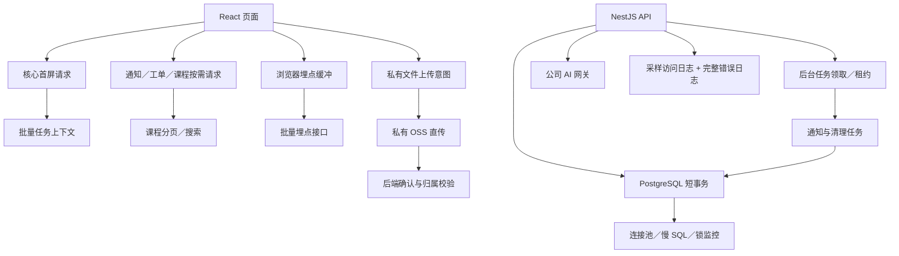

# 新师训练营教师端｜整体性能优化方案

## 0. 文档定位

| 项目 | 内容 |
| --- | --- |
| 文档状态 | 已完成本地代码实施与自动化回归，待测试环境压测和生产指标校准 |
| 日期 | 2026-07-29 |
| 分析对象 | 教师端 React 前端、NestJS 后端、PostgreSQL、后台 Worker、AI 网关和 OSS 上传链路 |
| 目标 | 缩短登录首屏等待，降低数据库与网络放大，保证多实例下后台任务不重复执行 |
| 事实依据 | 当前代码静态审查、前端生产构建结果、主 PRD 和现有技术方案 |
| 非目标 | 修改积分、任务、通知等业务口径；修改跨系统数据所有权；迁移成长地图公共素材 |

本文是性能治理方案，不替代主 PRD、共享任务表契约和数据库表结构。实施过程中如新增接口或调整物理字段，应同步检查相关文档；不因性能优化改变共享表写入边界。

成长地图公共资源已经迁移到 OSS，本方案不再处理其存储迁移。浏览器侧图片格式、尺寸和缓存策略可由公共素材发布流程单独治理。

### 0.1 2026-07-29 实施结果

| 阶段 | 已落地结果 |
| --- | --- |
| 首屏与请求 | 核心数据先展示；通知、工单、课程延后；任务上下文批量返回；课程服务端分页／搜索；普通请求统一超时 |
| 后台稳定性 | 四类调度任务使用全局租约；通知改为集合式或批量写入；旧照片队列和 Worker 已退役，G04 图片走当前任务提交与审核链 |
| 降噪 | 埋点最多 50 条批量写入；成功埋点和视频心跳日志采样；积分轮询指数退避并在后台暂停；版本化静态配置使用 500 条、10 分钟有界 LRU |
| 文件 | 私有 OSS 使用受限 POST Policy 直传和 HEAD 校验；本地兜底使用原始请求流计算 SHA-256 并流式写入，不再走内存型 multipart |
| 前端产物 | Help、Messages、登录和任务执行按需加载；相关 CSS 独立拆分；主入口由 646.30 KB／gzip 205.24 KB 降至 242.40 KB／gzip 78.97 KB |
| 监控 | `/health/dependencies` 增加数据库连接池和 Node RSS／Heap；后台租约和任务提交校验保留耗时与错误监控 |

构建已增加硬预算：单个 JS chunk 不得超过 500,000 字节，入口 gzip 不得超过 220,000 字节。当前结果来自本地生产构建，不替代隔离测试环境中的并发上传、多实例和真实数据库压测。

## 1. 总体结论

当前系统在低并发下可以正常运行，主要风险不是单个复杂算法，而是多个小操作叠加后的放大：

1. 登录后同时等待资料、积分、G01、通知、工单、全部课程和全部任务详情，非核心接口变慢也会阻塞首屏。
2. G04 图片审核包含文件读取和 AI 网络调用，仍需严格限制并发、内存和外部调用超时。
3. 通知调度器按老师或 assignment 逐条执行 SQL，多实例会重复扫描。
4. 埋点、视频心跳、积分轮询和成功日志形成大量小请求、小事务和日志。
5. 图片与文件上传以完整 `Buffer` 进入后端，多人同时上传时会放大内存和 GC 压力。

优化顺序：

```text
首屏可用性
  → 图片审核资源边界
  → 定时任务批量化
  → 埋点、轮询和日志降噪
  → 私有文件直传 OSS
  → 前端拆包与静态数据缓存
```

## 2. 优化原则

1. **核心先展示**：My TIDE 和 Tasks 只等待当前页面必需数据，其他数据在页面出现后补充。
2. **权威数据不长期缓存**：积分、逐课明细、任务状态和通知继续读取权威来源，不使用旧数据冒充当前结果。
3. **外部调用不占数据库事务**：AI、OSS、邮件等网络调用必须与数据库短事务分离。
4. **后台任务先领取再处理**：任何 Worker 都必须支持多实例并发、防重复和超时接管。
5. **批量优先**：任务详情、埋点、通知扫描和数据库写入尽量合并。
6. **失败互不拖累**：课程、工单或通知失败不得导致任务主页空白。
7. **先建立基线再定容量**：本文指标是建议验收线，正式阈值需结合测试环境和生产监控校准。

## 3. 建议验收目标

### 3.1 当前可确认基线

| 项目 | 当前情况 |
| --- | --- |
| 前端生产构建 | 主 JS 1,084.61 KB，gzip 325.32 KB；CSS 355.09 KB，gzip 65.61 KB |
| 登录请求 | 先发起 7 类请求，再按任务数量发起 N 个任务详情请求 |
| 课程请求 | 第一页返回总数后，并发获取全部剩余页面 |
| 积分同步 | 每 2 秒一次，最长 60 秒，最坏约 30 次 |
| G04 图片审核 | 由当前任务提交触发，结果保存到 `image_reviews / image_review_items`；无独立照片队列 |
| 数据库连接池 | 单池默认最多 10 个连接，单条语句默认 10 秒超时 |
| AI 网关 | 默认 30 秒超时；当前调用期间会持有数据库事务 |
| 通知调度器 | 启用后默认每 5 分钟扫描；当前按候选逐条写入 |

### 3.2 建议目标

| 领域 | 建议目标 |
| --- | --- |
| 登录首屏 | 测试网络下，登录恢复后核心内容 p75 ≤ 2 秒、p95 ≤ 4 秒 |
| 首屏依赖 | 非核心接口延迟 30 秒时，My TIDE 和 Tasks 核心内容仍可展示和操作 |
| 任务加载 | 任务数量增加时，首屏任务请求数保持常量，不再出现每个任务一个详情请求 |
| 课程加载 | 首屏最多请求一页课程；翻页或搜索时按需请求 |
| 接口超时 | 普通查询默认 15 秒；外部依赖有独立超时；上传不共用普通查询超时 |
| 积分同步 | 单次任务完成后的积分查询不超过 6 次／60 秒 |
| 照片处理 | 同一照片只产生一次有效 AI 审核；重复处理率为 0 |
| 数据库事务 | AI、OSS、邮件调用期间不持有数据库事务 |
| 后台任务 | 多实例同时运行时，同一批数据只有一个实例领取；通知仍通过幂等键防重 |
| 埋点 | 正常页面行为产生的埋点 HTTP 请求数减少 80% 以上 |
| 上传内存 | 上传过程不再要求后端同时持有完整文件和 Base64 副本 |
| 前端产物 | 主入口 JS gzip 建议降至 200 KB 左右，其余能力按路由或任务类型拆包 |

## 4. 目标结构



## 5. 分项设计

### 5.1 登录首屏与任务加载

#### 当前风险

- 登录后统一等待 7 类数据，全部结束后才设置 `dataReady`。
- 任务列表返回后，再以固定并发逐个读取任务详情，形成 N+1 网络请求和数据库查询。
- 课程前端会计算总页数并并发获取所有剩余页面。
- 普通 API 没有默认超时；某个请求长期无响应时，首屏也会长期等待。

#### 改造方案

将登录初始化拆成两层：

**核心层**

- 教师资料；
- My TIDE 积分总览；
- G01 当前审核状态；
- 当前老师的任务卡片和必要进度。

核心层完成后立即展示页面。单个核心来源失败时展示局部错误和重试，不再回退为整页空白。

**延迟层**

- 通知和未读数；
- 工单列表；
- 课程第一页；
- 仅在 Help、Messages 或课程明细中使用的数据。

延迟层在页面展示后加载，或者在用户进入对应页面时加载。

任务加载改为常量请求：

1. 后端提供批量任务上下文读取能力，建议在现有 `GET /api/v1/tasks` 上增加明确的 `include=context`，或新增内部批量读取接口。
2. 后端先查询当前老师全部合法 assignment，再用一次查询读取这些 assignment 的步骤与进度。
3. 前端任务详情页仍可单独刷新某一个任务，但首屏不再逐个请求。

课程加载改为服务端分页：

- 默认每页 20 条；
- My TIDE 只读取当前页；
- 工单中的课次搜索改为后端关键字／课次分页搜索；
- 不再为了下拉框预先下载全部历史课程。

API 客户端增加统一超时：

- 普通 GET 默认 15 秒；
- 普通命令默认 20 秒；
- AI、上传、视频等接口使用各自超时；
- 外部传入 `AbortSignal` 时与超时信号合并；
- 超时只影响对应数据源，不清空其他已经成功的数据。

#### 验收

- 课程接口人为延迟 30 秒，My TIDE 和 Tasks 仍按时展示。
- 老师拥有 10、30、100 个任务时，首屏任务 HTTP 请求数保持不变。
- 任一任务详情失败时，其余任务仍可展示并允许单独重试。
- 页面不再出现只有空白背景、没有错误提示的长期等待状态。

### 5.2 积分同步、埋点和日志

#### 积分同步

当前任务完成后每 2 秒读取一次积分，最坏 60 秒内约 30 次。

改为指数退避：

```text
立即查询一次
  → 2 秒
  → 4 秒
  → 8 秒
  → 15 秒
  → 15 秒
  → 到达 60 秒后停止
```

- 页面进入后台时暂停轮询；
- 页面恢复前台时再查询一次；
- 同一浏览器同时只有一个积分同步任务；
- 任务完成时间或计分版本变化后立即结束。

#### 埋点

前端继续保留 100 条有界队列和幂等 `event_id`，发送方式改为批量：

- 达到 20 条、等待 5 秒、页面隐藏或退出时触发发送；
- 单批最多 50 条，单条仍执行字段白名单和大小校验；
- 页面退出使用 `fetch(..., { keepalive: true })`；
- 失败按批次退避，永久错误丢弃对应事件，不阻塞业务请求。

后端新增批量保存能力：

- 每批只查询一次教师绑定；
- 通过集合查询校验任务归属和补充任务版本信息；
- 使用批量 INSERT，并继续依赖 `event_id` 唯一约束防重；
- 单条失败返回对应索引，不让一条脏数据无限重试整批。

#### 日志

- 错误、超时、限流和慢请求继续完整记录；
- `/api/v1/app-events` 成功请求不逐条记录，或按 1%–5% 采样；
- 视频心跳成功日志采样，完成、失败和异常跳跃完整记录；
- 定时任务只记录批次汇总，不逐条记录老师或 assignment；
- 增加日志量、每分钟错误数和单接口 p95，不在日志中打印完整请求体、图片或 AI 原文。

#### 验收

- 常规页面浏览和任务操作的埋点请求数减少 80% 以上。
- 断网后队列不超过 100 条，恢复网络后可以继续批量发送。
- 埋点服务异常不影响任务、积分和上传操作。
- 日志仍能定位错误请求，但成功埋点和心跳不再形成大量重复日志。

### 5.3 当前图片审核与 AI 调用

迁移 `0029_remove_unused_tide_objects` 已删除无消费者的 `teacher_photo_runs` 及旧照片 Worker。当前 G04 只保留一条图片链路：

```text
任务提交关联 task_submission_files
  → AI_IMAGE_REVIEW 校验器读取私有文件
  → image_reviews / image_review_items 保存审核事实
  → 任务状态按当前验证规则更新
```

运行边界：

- 不再创建独立照片队列、滤镜产物或 Worker 租约；
- AI 或 OSS 临时失败记录为技术不可用，不把老师判为失败；重试通过任务提交命令的幂等边界执行；
- 外部调用不能包在长数据库事务中，最终审核事实使用短事务写入；
- 输入继续受 MIME、大小、像素、SHA-256 和私有文件归属校验约束；
- AI 网关只能接收内联图片时，先限制像素和文件大小，再进行 Base64；
- 用接口并发门禁和网关超时控制 CPU、RSS 与连接压力，不增加第二套照片状态机。

#### 验收

- 同一个幂等任务提交不会产生相互冲突的审核结论；
- AI 超时期间不持有数据库长事务；
- 技术失败对教师显示为暂不可用，并保留重新提交入口；
- 监控能区分文件读取、AI 超时、返回格式错误和数据库写入失败。

### 5.4 通知与清理调度器

#### 当前风险

- 进程内 `running` 只能防止单实例重叠，无法协调多实例。
- 成长阶段扫描先读取全部老师，再逐人执行多条 SQL。
- 个性化任务提醒先查询全部候选，再逐条插入通知。
- 工单图片清理没有跨实例领取，多个实例可能重复删除同一 OSS 对象。

#### 改造方案

第一步增加通用任务租约：

```text
tide.job_leases
  job_key
  owner_id
  lease_until
  updated_at
```

- 每类调度任务启动前尝试领取租约；
- 未领取到的实例直接结束本轮；
- 长批次定时续租；
- 幂等键和 `ON CONFLICT DO NOTHING` 继续作为最终防线。

第二步改为批量和集合式 SQL：

- 成长阶段按 `teacher_id` 游标分批，每批建议 200 条起步；
- 使用 CTE 计算本批最高开放阶段；
- 批量 UPSERT 阶段状态，只对真正升阶的记录生成通知；
- 个性化任务按 `assigned_at / assignment_id` 或 `due_at / assignment_id` 分页；
- 一批提醒通过批量 INSERT 写入；
- 工单清理先原子领取一批 ticket，再删除 OSS 对象并回写结果。

索引必须先通过真实库 `EXPLAIN (ANALYZE, BUFFERS)` 确认。共享 `public.task_assignments` 的索引调整需要和世文侧协作，不由教师端单方面变更。

#### 验收

- 两个实例同时触发同一调度器，只有一个实例执行有效批次。
- 数据量增长时，单批耗时稳定，不随全表数据线性增长。
- 调度器运行期间在线接口 p95 和数据库连接池等待没有明显抬升。
- 重启、重试和并发扫描不会产生重复通知或重复删除异常。

### 5.5 数据库、缓存和外部读取

#### 数据库

1. 单条世文 SELECT 直接使用连接池查询，不再为每条查询额外执行 `BEGIN READ ONLY / COMMIT`。
2. 多条查询需要一致快照时，才使用只读事务。
3. `source_read_status` 成功状态不再每次请求都更新，可改为状态变化时更新，或最多每 5 分钟刷新一次。
4. 所有数据库查询继续保留连接超时和语句超时。
5. 增加连接池活跃数、空闲数、等待数、等待时间和超时次数监控。
6. 使用 `pg_stat_statements` 定期检查总耗时、调用次数和平均读取行数最高的 SQL。

#### 缓存

允许缓存：

- 已发布且版本不可变的任务模板；
- 任务执行版本和步骤定义；
- FAQ 目录等版本化静态配置。

建议使用进程内有界 LRU：

- 以版本 ID 为 Key；
- 最大 500 条起步；
- TTL 10 分钟作为兜底；
- 发布新版本使用新 Key，不覆盖正在执行的旧版本。

禁止缓存或只允许本次请求内复用：

- `teacher_scorecard_current`；
- `teacher_lesson_score_current`；
- assignment 当前状态和 `row_version`；
- 通知未读数；
- 文件和照片当前处理状态。

这样可以减少静态配置重复查询，同时不破坏权威数据实时性。

### 5.6 私有文件和工单图片上传

成长地图等公共素材继续使用现有 OSS 地址。本节只处理老师上传的私有证据和工单图片。

推荐改为 OSS 直传：

```text
前端创建上传意图
  → 后端校验老师、任务、文件类型和大小
  → 返回短期签名上传地址和受限 objectKey
  → 前端直接上传私有 OSS
  → 前端调用 complete
  → 后端通过 OSS metadata／HEAD 校验并标记 READY
```

要求：

- Bucket 保持私有；
- objectKey 必须由后端生成，不接受前端自由指定；
- 签名限制类型、大小、有效期和目标路径；
- 下载仍校验当前登录老师和文件归属；
- 工单关闭后的生命周期清理继续由后端负责；
- 无法立即直传时，后端上传接口至少改为流式 SHA 和流式 OSS 写入，不再使用完整内存 `Buffer`。

#### 验收

- 上传 10 MB 文件时，后端 RSS 不随完整文件大小等比例增加。
- 20 个并发上传不会导致明显 GC 停顿或在线接口超时。
- 无效签名、越权 objectKey、超限文件和不支持类型均被拒绝。
- 工单图片关闭后仍能按现有保留规则清理。

### 5.7 前端代码拆包

公共素材迁移到 OSS 后，前端代码包仍需要单独治理：

- My TIDE 和 Tasks 基础壳保留在主入口；
- Help、Messages、Account、任务详情按路由懒加载；
- 各任务执行组件按任务类型或任务编码动态加载；
- GSAP 只在使用动画的页面加载；
- Markdown、FAQ 和大型任务内容不进入首页主包；
- 合并重复全局 CSS，按页面拆出非首屏样式；
- 路由切换前可以预取下一步最可能使用的 chunk，但不全量预取。

#### 验收

- 构建不再出现单个主 chunk 超过 500 KB 的告警。
- 首页主 JS gzip 接近 200 KB，任务专属能力进入独立 chunk。
- 慢网络下首页先可操作，再加载 Help、消息和任务执行代码。

## 6. 实施阶段

### 阶段 0：建立性能基线

- 记录登录恢复、核心数据可用、整页数据完成三个时间点；
- 记录主要接口 p50／p95／p99；
- 接入数据库连接池、慢 SQL、锁等待、后台租约、图片校验耗时和进程 RSS 指标；
- 保存一次当前生产构建体积和浏览器请求瀑布作为对照。

完成标准：可以量化每次优化前后的变化，而不是只凭体感判断。

### 阶段 1：首屏和请求降载

- 首屏核心层／延迟层拆分；
- 任务上下文批量接口；
- 课程按需分页与搜索；
- API 默认超时；
- 积分同步指数退避；
- 页面局部错误与局部重试。

完成标准：非核心接口变慢不阻塞首屏，任务数量不再放大 HTTP 请求数。

### 阶段 2：后台稳定性

- 图片审核的并发、超时和任务提交幂等边界；
- AI、OSS 调用保持在数据库长事务之外；
- 调度器任务租约；
- 通知扫描和工单清理分批处理。

完成标准：幂等提交不产生冲突审核结论，无长事务占用连接，后台任务不拖慢在线接口。

### 阶段 3：埋点、日志和数据库降噪

- 批量埋点接口；
- 高频成功日志采样；
- 单条世文查询移除显式事务；
- `source_read_status` 写入节流；
- 版本化静态数据 LRU。

完成标准：埋点与日志请求量明显下降，数据库高频小事务减少。

### 阶段 4：上传和前端产物

- 私有 OSS 直传；
- 后端流式上传兜底；
- 路由和任务组件拆包；
- CSS 拆分与构建体积预算。

完成标准：并发上传内存稳定，首页主包达到体积预算。

## 7. 监控与排查

| 领域 | 必看指标 |
| --- | --- |
| 前端 | 核心数据可用时间、页面可操作时间、接口失败率、超时率、首屏请求数、JS chunk 体积 |
| HTTP | 各接口请求量、p50／p95／p99、5xx、429、主动取消和超时 |
| PostgreSQL | 活跃连接、连接等待、事务时长、锁等待、慢 SQL、扫描行数／返回行数 |
| Worker | 待处理数、最老等待时间、领取失败、租约过期、重试次数、单批耗时 |
| AI | 调用次数、重复请求、p95 延迟、超时率、错误码和单次图片大小 |
| Node.js | RSS、Heap Used、Event Loop Lag、GC 次数和停顿 |
| OSS | 上传／读取／删除延迟、失败率、签名失败和清理积压 |
| 日志 | 每分钟日志量、错误日志量、高频接口采样比例和单条日志大小 |

建议排查顺序：

1. 先看请求瀑布和接口 p95，确认慢在浏览器还是后端。
2. 再看连接池等待、长事务和 `pg_stat_statements`。
3. 图片相关问题同时看 RSS、GC、Sharp 并发和 AI 延迟。
4. 周期性尖峰优先对照调度器启动时间和批次大小。

## 8. 测试方案

### 功能回归

- 登录、退出、会话恢复和密码重置；
- My TIDE、Tasks、任务详情和成长地图；
- 阔知进度、视频进度、上传、提交和积分同步；
- Messages、工单和课程分页；
- 照片 PASS／RETRY／ERROR 全流程。

### 并发与故障演练

1. 同时运行两个后端实例，提交同一张照片，验证只处理一次。
2. 同时触发两个通知调度器，验证通知不重复。
3. 人为让 AI 网关超时，验证数据库没有长事务和连接池耗尽。
4. 人为让课程、通知或工单接口延迟 30 秒，验证首屏仍可用。
5. 制造 OSS 上传变慢和失败，验证内存稳定、请求可重试。
6. 使用不同任务数量测试首屏，验证 HTTP 和 SQL 查询数量保持常量。
7. 模拟埋点接口失败和恢复，验证队列有上限且业务不受影响。

性能压测应在隔离测试环境进行，不能直接对生产数据库和公司 AI 网关做无上限并发。

## 9. 发布与回滚

### 发布控制

建议为关键改造增加临时开关：

- `TASK_CONTEXT_BATCH_ENABLED`
- `PHOTO_WORKER_LEASE_ENABLED`
- `SCHEDULER_JOB_LEASE_ENABLED`
- `APP_EVENT_BATCH_ENABLED`
- `DIRECT_OSS_UPLOAD_ENABLED`

数据库变更采用向后兼容顺序：

```text
先增加可空字段和索引
  → 发布兼容新旧字段的代码
  → 小流量启用新逻辑
  → 验证指标
  → 再移除旧路径
```

### 回滚

- 首屏分层异常：关闭新开关，恢复原请求组织方式。
- 批量任务接口异常：保留单任务详情接口作为回退。
- 图片审核异常：关闭 AI 网关或让校验返回技术不可用，不删除已保存的提交与审核事实。
- 调度器异常：关闭对应 Scheduler，不删除已生成通知，依赖幂等键继续防重。
- 批量埋点异常：回退单条上报或临时停埋点，不影响业务链路。
- OSS 直传异常：回退受限的后端流式上传，不回退到永久公开文件地址。

## 10. 文档联动

实施时按改动范围检查：

| 改动 | 需要检查的文档 |
| --- | --- |
| 任务批量接口、课程搜索接口 | 主 PRD 的页面加载体验、接口说明 |
| `image_reviews / image_review_items`、`job_leases` | 《数据库表结构》 |
| 共享 `task_assignments` 索引 | 《教师端共享任务表契约》并与世文侧确认 |
| 私有 OSS 直传字段和状态 | 主 PRD、《数据库表结构》、文件接口说明 |
| 调度器批量和锁机制 | 《系统通知改造方案》 |

本方案不修改积分规则、任务完成规则、通知内容、共享 assignment 所有权或教师端表达口径。

## 11. 优先级

### P1：优先处理

- 首屏核心层／延迟层拆分；
- 任务上下文批量读取；
- 图片审核并发、超时、幂等与外部调用事务边界；
- 通知与清理调度器的跨实例锁和分批处理。

### P2：排期优化

- API 超时和局部重试；
- 课程分页与搜索；
- 积分同步退避；
- 批量埋点和日志采样；
- 私有文件直传 OSS；
- 前端路由与任务组件拆包。

### P3：持续治理

- 单条世文查询移除显式事务；
- `source_read_status` 写入节流；
- 版本化静态数据 LRU；
- 构建体积预算和定期慢 SQL 复盘。

## 12. 补充说明

本方案基于当前代码静态审查和本地生产构建，不等同于真实压测结果。首屏目标、批次大小、Worker 并发、连接池容量和告警阈值需要结合盖娅部署规格、真实老师数量、生产数据库监控和 AI 网关限制最终确认。
